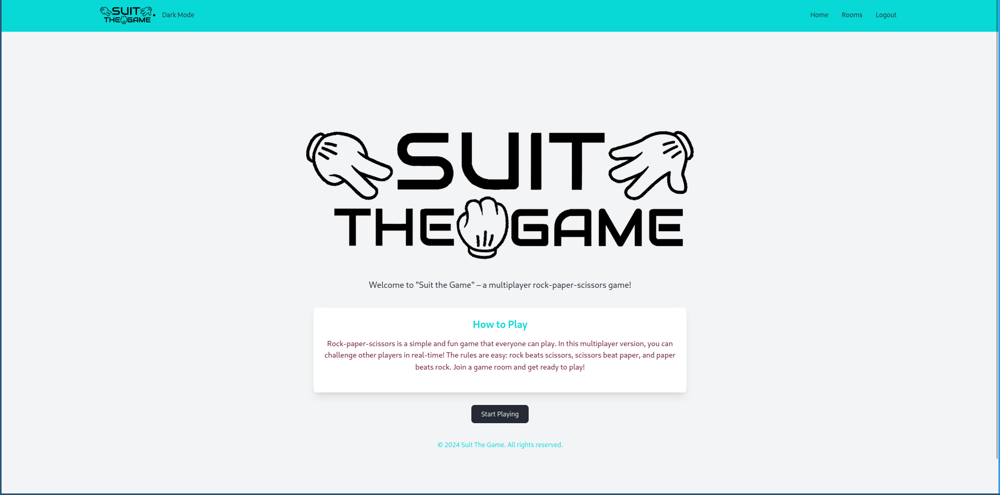
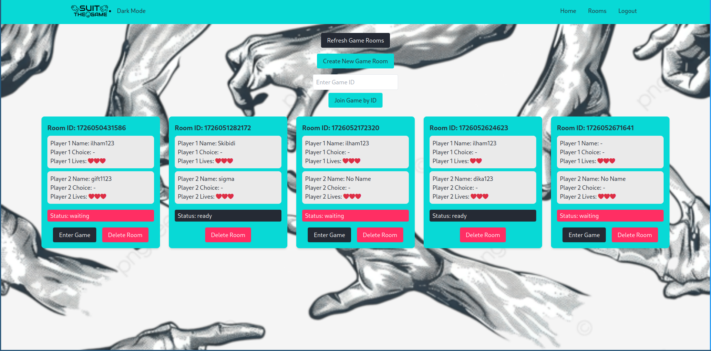
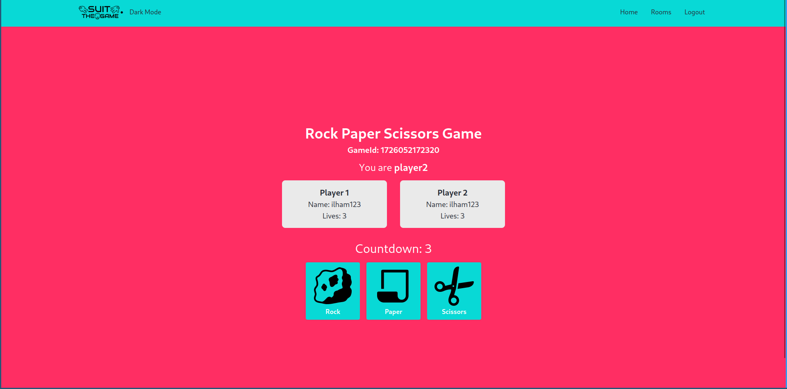

<h1 align="center">SUIT THE GAME</h1>

  

### What is SUIT THE GAME?

SUIT THE GAME is an implementation of the classic rock-paper-scissors game using React and Firebase Realtime Database. Players can start the game, join a room, battle against other opponents, choose rock, paper, or scissors, and view the results.

### What features does SUIT THE GAME have?

- User login
- Create a room / join an existing room
- Leave button to exit the room
- Ready button to start the game
- Once both players are ready, there will be a countdown to set a time limit for making a choice
- The winner is determined when other player’s lives run out
- When the game ends, it will be deleted and return to the rooms list

### What technologies are used in SUIT THE GAME?

- [React](https://react.dev/) as the framework for building the front-end
- [Firebase Realtime Database](https://firebase.google.com/) for storing data and synchronizing game in real-time
- [Tailwind CSS](https://tailwindcss.com/) as the CSS framework for building UI
- [React-Toastify](https://www.npmjs.com/package/react-toastify) for displaying toast notifications
- [SweetAlert2](https://www.npmjs.com/package/sweetalert2/v/6.6.1?activeTab=readme) for displaying alert messages

### Who contributed to SUIT THE GAME?

- [Quadrant Barokatus Salam](https://github.com/quadrantbs)
- [Fabian Tenzara](https://github.com/tzrfabian)
- [Nur Rahman Ilhamza](https://github.com/Ilhamza123)
- [Garindra Gustianto](https://github.com/indragusti)

### Room

  

### Duel

  

