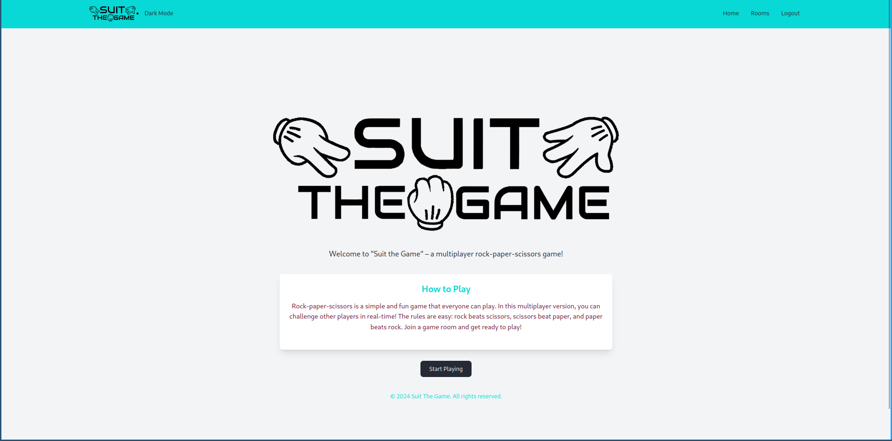
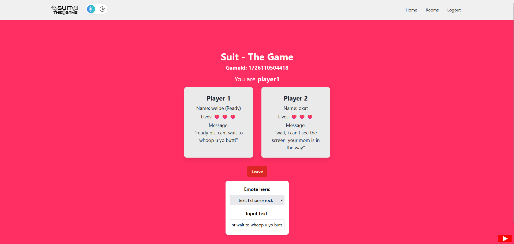

<h1 align="center">SUIT THE GAME</h1>

  

### Apa itu SUIT THE GAME ?

SUIT THE GAME adalah implementasi dari permainan klasik gunting batu kertas (rock paper scissors) menggunakan React dan Firebase Realtime Database. Pemain bisa bergabung ke dalam permainan, memilih opsi batu / gunting / kertas, melihat hasil, dan tentunya melawan pemain lain secara real-time.

### Fitur apa saja yang ada di SUIT THE GAME ?

- User login
- Membuat room / gabung ke room yang sudah ada
- Tombol leave untuk keluar room
- Tombol ready untuk memulai permainan
- Setelah kedua pemain ready, maka akan ada countdown sebagai batas waktu untuk menentukan pilihan
- Penentuan pemenang terjadi ketika salah satu pemain nyawanya telah habis
- Jika permainan selesai, maka permainan akan dihapus dan kembali ke daftar rooms

### Teknologi apa saja yang dipakai di SUIT THE GAME ?

- [React](https://react.dev/) sebagai framework untuk membuat front-end
- [Firebase Realtime Database](https://firebase.google.com/) untuk menyimpan data dan sinkronisasi permainan secara real-time
- [Tailwind CSS](https://tailwindcss.com/) sebagai framework css untuk membuat UI
- [React-Toastify](https://www.npmjs.com/package/react-toastify) untuk menampilkan notifikasi toast
- [SweetAlert2](https://www.npmjs.com/package/sweetalert2/v/6.6.1?activeTab=readme) untuk menampilkan pesan notifikasi

### Siapa saja yang berkontribusi dalam SUIT THE GAME ?

- [Quadrant Barokatus Salam](https://github.com/quadrantbs)
- [Fabian Tenzara](https://github.com/tzrfabian)
- [Nur Rahman Ilhamza](https://github.com/Ilhamza123)
- [Garindra Gustianto](https://github.com/indragusti)

### Room

  

### Duel

  

